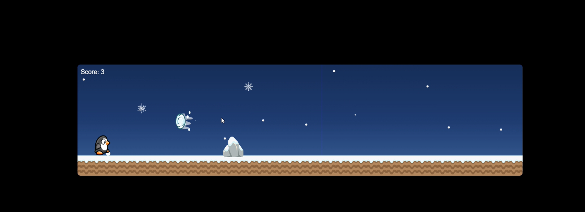

# 🐧 Penguin Dash ❄️

A fun browser-based game inspired by Chrome’s Dino Runner — but with a penguin running through a snowy night! Dodge snowballs and icy blocks, jump over obstacles, and see how long you can survive.  

---

## ✨ Features
- Penguin character that jumps with the **spacebar**  
- Snowy night background with falling snowflakes  
- Random obstacles (snowballs, ice blocks) appearing with variation  
- Score counter that increases as you survive  
- **Game Over** message displayed inside the game screen  
- Restart the game quickly by pressing **spacebar**  
- Difficulty increases as the game progresses  

---

## 🎮 How to Play
1. Open `index.html` in your browser.  
2. Press **spacebar** to make the penguin jump.  
3. Avoid snowballs and icy blocks.  
4. When you collide with an obstacle, the game shows **GAME OVER**.  
5. Press **spacebar** again to restart and try for a higher score!  

## 📸 Game Play
<video src="doc/20250919-1903-59.5191727.mp4" controls width="600"></video>

---

## 📂 Project Structure
Penguin-Dash/
│
├── index.html # Main game file
├── style.css # Game styling
├── script.js # Game logic
└── assets/ # Images, sprites, and background (optional)

---

## ⚡ Setup Instructions
- Clone or download this repository.  
- Open `index.html` in any modern browser.  
- No installation, no libraries — **just pure HTML, CSS, and JavaScript**.  

---

## 🚀 Future Improvements
- Animated penguin sprites (running, jumping)  
- Background music and jump sound effects  
- More obstacle types (snowmen, ice spikes, igloos)  
- Mobile/touch controls support  
- High-score saving  

---

## 📜 License
This project is licensed under the **MIT License**.  
Feel free to use, modify, and share!  
